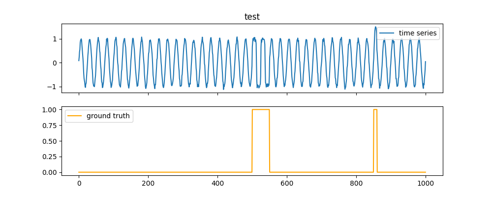

<div align="center">
    
    <p>
    A good <strong>T</strong>imeseries <strong>A</strong>nomaly <strong>G</strong>enerator.
    </p>

[](https://gitlab.hpi.de/akita/guten-tag/-/commits/main)
[](https://gitlab.hpi.de/akita/guten-tag/-/commits/main)

[](setup.py)
[](https://opensource.org/licenses/MIT)
[](setup.py)

</div>

GutenTAG is an extensible tool to generate time series datasets with and without anomalies.
A GutenTAG time series consists of a single (univariate) or multiple (multivariate) channels containing a base osciallation with different anomalies at different positions and of different kinds.

## tl;dr

[](./doc/introduction/base-oscillations.md)
[](./doc/introduction/anomaly-types.md)
[](./doc/advanced-features.md)

[](./doc/usage.md)

The following call uses the [`example-config.yaml`](generation_configs/example-config.yaml) configuration file to generate a single time series with two anomalies in the middle and the end of the series.

```bash
python -m gutenTAG --config-yaml generation_configs/example-config.yaml --seed 11 --no-save --plot
```



## Documentation

GutenTAG's documentation can be found [here](doc/index.md).


# TODO

- [ ] negation anomaly (does a pattern not appear)
