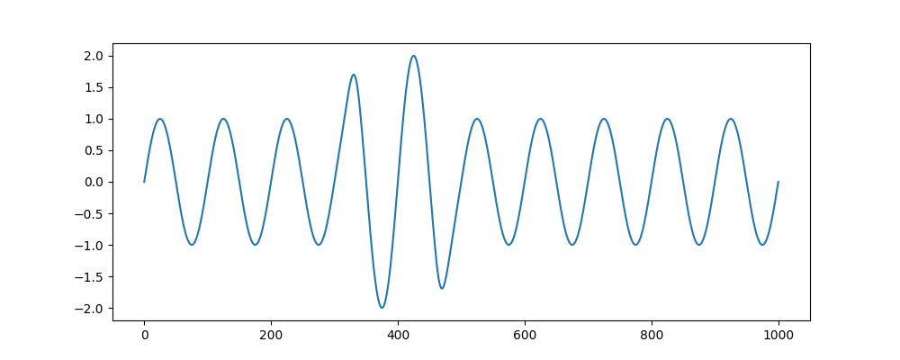
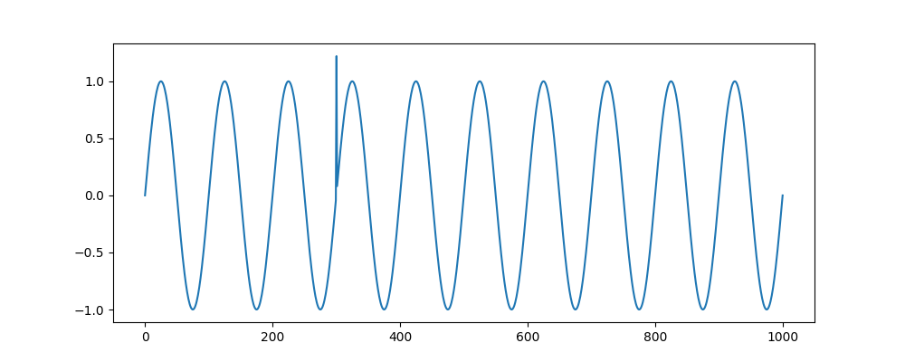
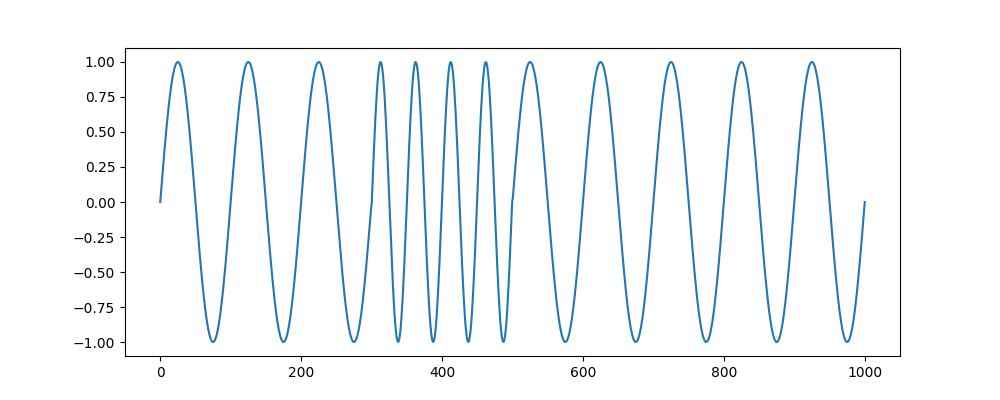
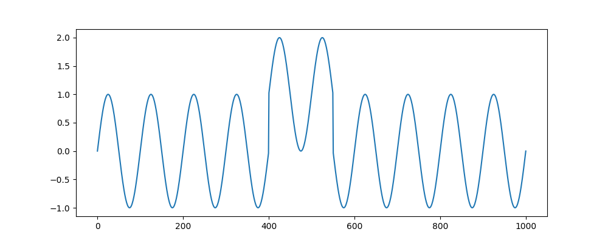
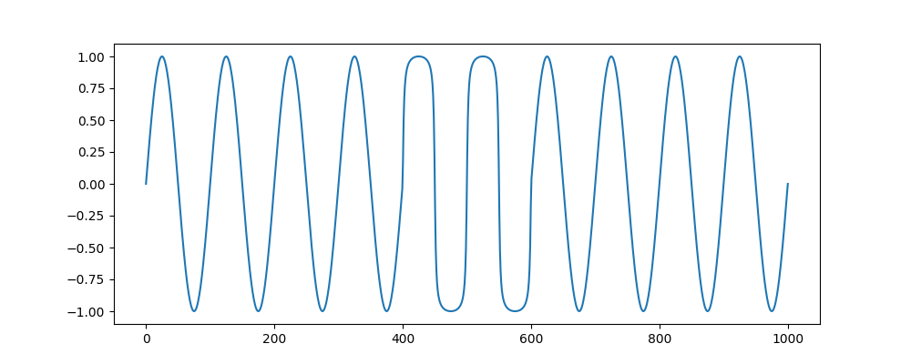
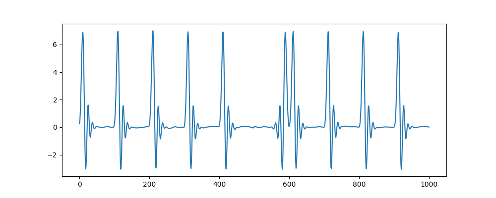
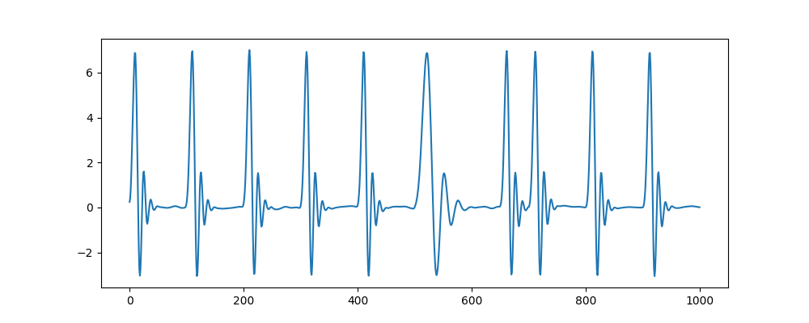
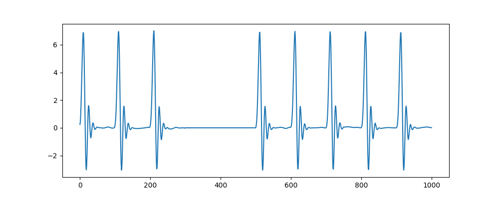
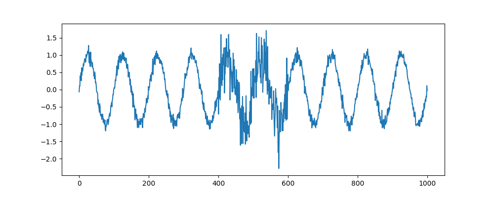
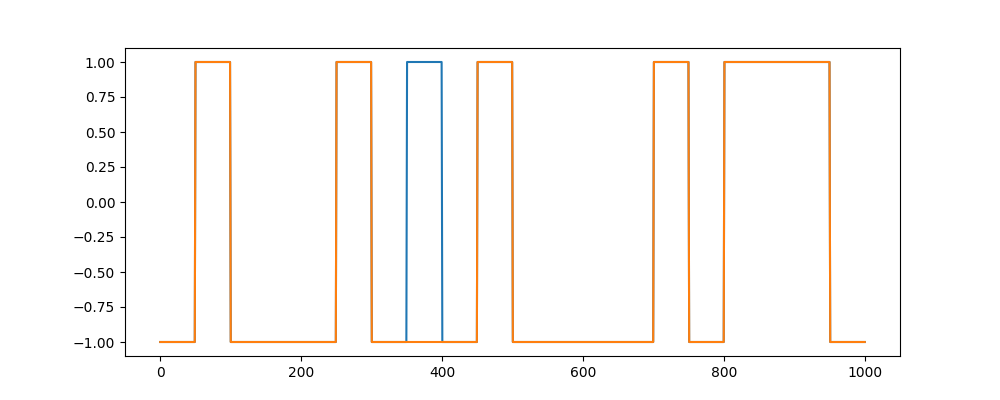

# Anomaly Types

The generator comes with the following anomaly types in [gutenTAG/anomalies/types](../../gutenTAG/anomalies/types):

- amplitude
- extremum
- frequency
- mean
- pattern
- pattern-shift
- platform
- trend
- variance
- mode-correlation

**General Anomaly Properties**

|Name|Type|Description|
|----|----|-----------|
|kind|Enum['amplitude','extremum','frequency','mean','pattern','pattern_shift','platform','trend','variance']|Kind of anomaly (see below)|
|position|Enum['beginning','middle','end']|Position of anomaly|
|length|Int|Length of anomaly|
|channel|Int|ID of channel on which anomaly should be applied|

## Amplitude



**Parameters**

|Name|Type|Description|
|----|----|-----------|
|amplitude_factor|Float|Change factor of amplitude|

## Extremum



**Parameters**

|Name|Type|Description|
|----|----|-----------|
|min|Bool|Whether it's a minimum or maximum|
|local|Bool|Whether it's local or global|
|context_window|Int|[Only `local`] how many points to the left and right are used to calculate extremum|

## Frequency



**Parameters**

|Name|Type|Description|
|----|----|-----------|
|frequency_factor|Float|Relative change of frequency|

## Mean



**Parameters**

|Name|Type|Description|
|----|----|-----------|
|offset|Float|Value to shift time series on Y-axis|

## Pattern




**Parameters**

| Name               | Type  | Description                                                                       |
|:-------------------|:------|:----------------------------------------------------------------------------------|
| sinusoid_k         | Float | [Only for `sine` and `cosine`] Ramming factor for changing sine waves.            |
| square_duty        | Float | [Only for `square`] New duty of the square wave.                                  |
| cbf_pattern_factor | Float | [Only for `cylinder_bell_funnel`] Pattern variance factor for change in CBF wave. |

Only one of the parameters above is necessary.
`sinusoid_k` works with `sine` BOs, while `cbf_pattern_factor` works with `cylinder-bell-funnel` BOs.

## Pattern Shift



**Parameters**

| Name              | Type | Description                                                                   |
|:------------------|:-----|:------------------------------------------------------------------------------|
| shift_by          | Int  | Size of the shift length to the right. Can be negative for shift to the left. |
| transition_window | Int  | Number of points to the left and right used for transition.                   |

## Platform



**Parameters**

|Name|Type|Description|
|----|----|-----------|
|value|Float|Value of the platform on Y-axis|

## Trend


A trend anomaly can have any form of the base oscillations.
Use the same parameters as for the base oscillations.

## Variance



**Parameters**

|Name|Type|Description|
|----|----|-----------|
|variance|Float|Value of the new variance|

## Mode Correlation



Takes 1-d subsequence of arbitrary length and changes the mode to the opposite.

**Parameters**

None

## Adding a new Anomaly Type

1. create a new Enum type for [`AnomalyKind`](../../gutenTAG/anomalies/types/kind.py) and adapt the `generate` method
2. [RECOMMENDED] create a new anomaly type class under [gutenTAG/anomalies/types](../../gutenTAG/anomalies/types)
    1. the new class should inherit from [`gutenTAG.anomalies.BaseAnomaly`](../../gutenTAG/anomalies/types/__init__.py)

## Creepy Anomaly

Some anomaly types (`amplitude`, `mean`, and `variance`) allow for a transition into the anomaly - a creep. 
Therefore, the additional parameter `creep-length` for an anomaly is introduced. It takes `creep-length` points 
from the overall `length` anomaly points and creates a linear transition into the `length - creep-length` anomaly. 

### Example

```yaml
timeseries:
  - name: variance
    length: 1000
    base-oscillations:
      - kind: sine
        frequency: 2
        variance: 0.1
    anomalies:
      - exact-position: 460
        length: 540
        creep-length: 500
        channel: 0
        kinds:
          - kind: variance
            variance: 1.0
```


