# Base Oscillations

The generator comes with the following base oscillations in [gutenTAG/base_oscillations](../../gutenTAG/base_oscillations):

- sine
- cosine
- square
- random-walk
- cylinder-bell-funnel
- ecg
- polynomial
- random-mode-jump
- formula
- sawtooth
- dirichlet
- mls

Base oscillations can have an underlying trend.
This trend can be any of the above base oscillations.

Using the `variance` property, you can add noise to the base oscillation.
The general kind of base oscillation is always the same for all channels of a time series.
However, noise and other random parameters differ between channels.

## Common Parameters

Parameters for a new time series.

|Name|Type|Description|
|----|----|-----------|
|name|String|Optional name for timeseries|
|length|Int|Length of entire time series|
|channels|Int|Number of dimensions|
|semi-supervised|Bool|Whether a train file without anomalies should be generated|
|supervised|Bool|Whether the train file should contain labels|

These parameters can be set for all base oscillations.

|Name|Type|Description|
|----|----|-----------|
|variance|Float|Noise factor dependent on amplitude|
|trend|Object|Defines another base oscillation as trend that gets added to its parent object. Can be recursively used!|
|offset|Float|Gets added to the generated time series|

## Sine

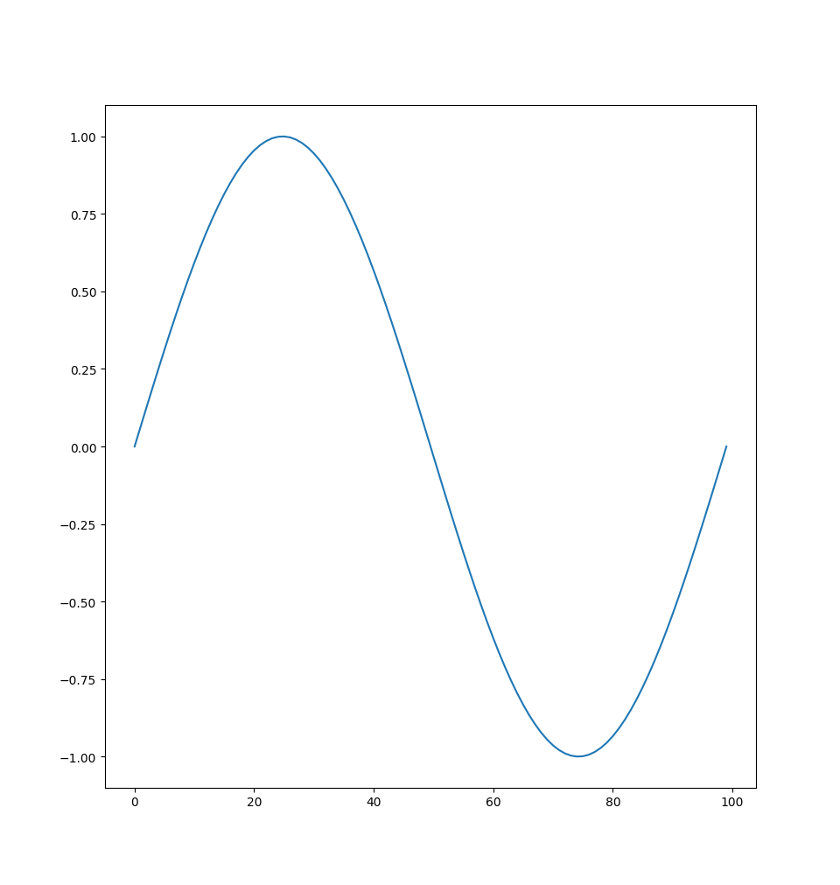

**Parameters**

|Name|Type|Description|
|----|----|-----------|
|frequency|Float|Number of sine waves per 100 points|
|amplitude|Float|+/- deviation from 0|
|freq-mod|Float|Factor (of base frequency) of the frequency modulation that changes the amplitude of the sine wave over time. The carrier wave always has an amplitude of 1.|

## Cosine

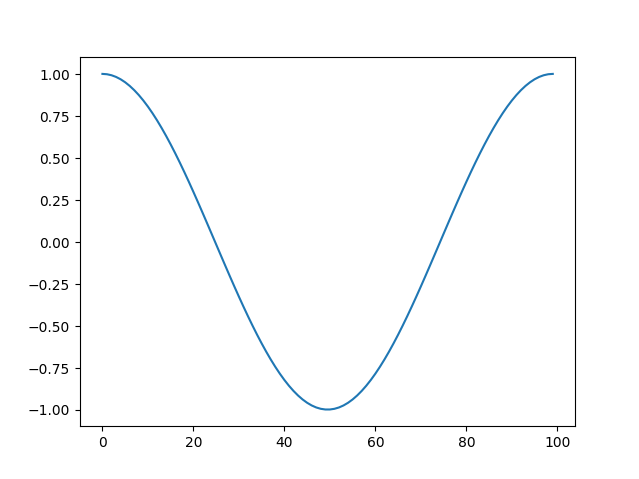

**Parameters**

| Name      | Type  | Description                                                                                                                                                 |
|:----------|:------|:------------------------------------------------------------------------------------------------------------------------------------------------------------|
| frequency | Float | Number of cosine waves per 100 points                                                                                                                       |
| amplitude | Float | +/- deviation from 0                                                                                                                                        |
| freq-mod  | Float | Factor (of base frequency) of the frequency modulation that changes the amplitude of the wave over time. The carrier wave always has an amplitude of 1.     |

## Square

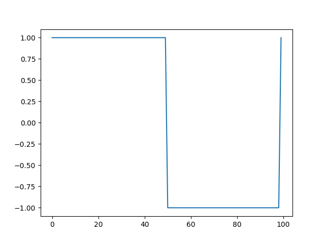

**Parameters**

| Name      | Type  | Description                                                                                                                                             |
|:----------|:------|:--------------------------------------------------------------------------------------------------------------------------------------------------------|
| frequency | Float | Number of square waves per 100 points                                                                                                                   |
| amplitude | Float | +/- deviation from 0                                                                                                                                    |
| freq-mod  | Float | Factor (of base frequency) of the frequency modulation that changes the amplitude of the wave over time. The carrier wave always has an amplitude of 1. |
| duty      | Float | Load percentage (time spent in high state compared to low state).                                                                                       |

## Random Walk

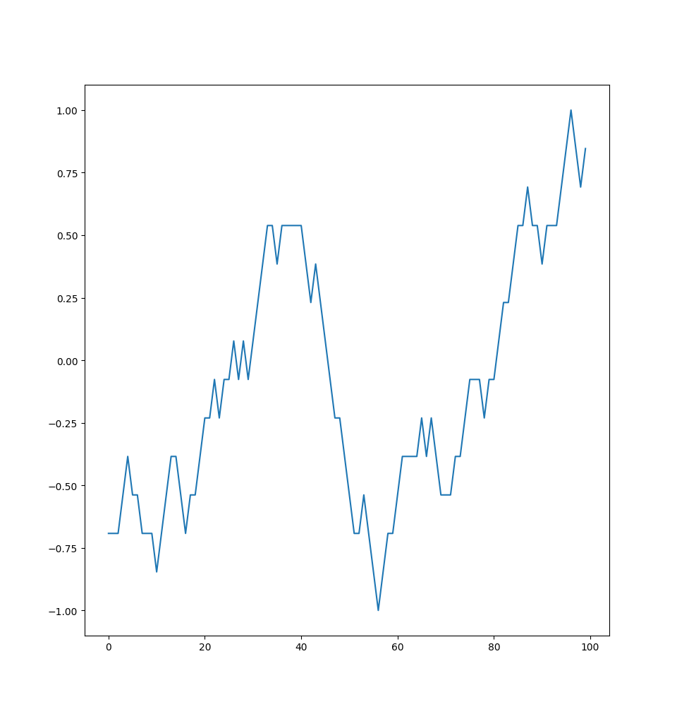

**Parameters**

|Name|Type|Description|
|----|----|-----------|
|amplitude|Float|+/- deviation from 0|
|smoothing|Float|`0.01` Smoothing factor for convolution dependent on length|


## Cylinder Bell Funnel

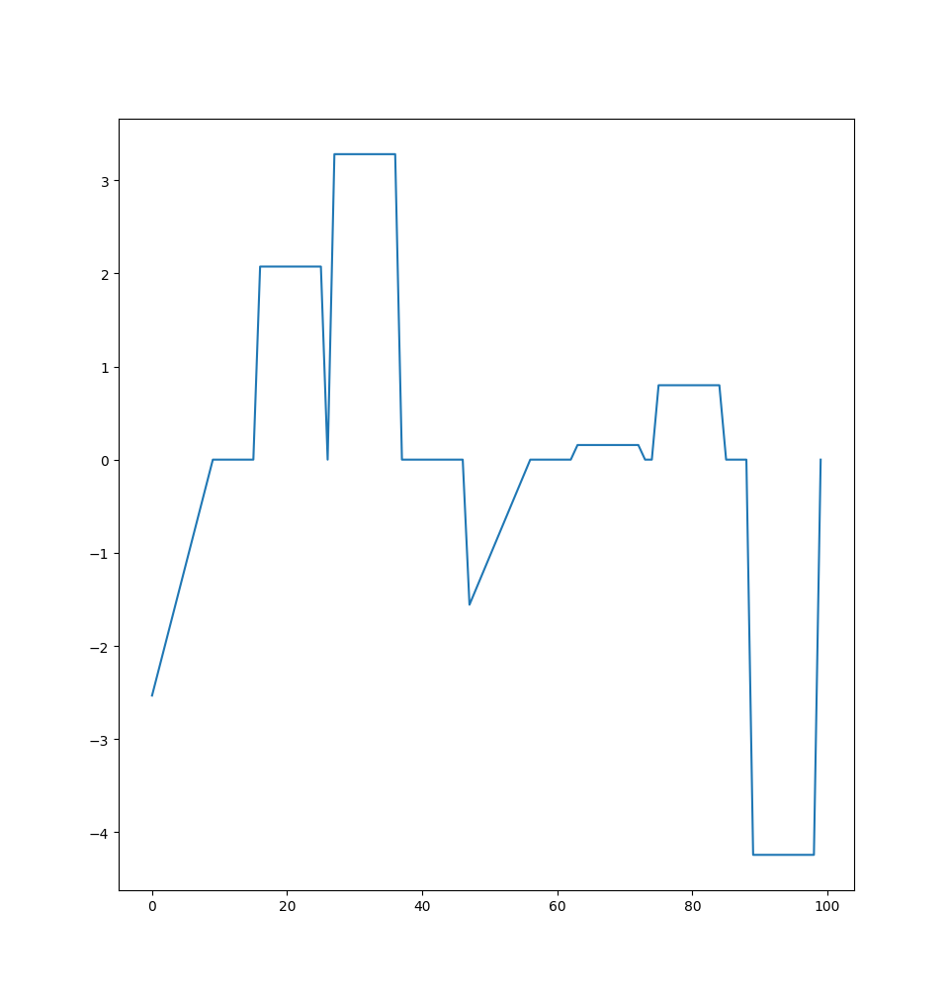

**Parameters**

|Name|Type|Description|
|----|----|-----------|
|avg-pattern-length|Int|Average length of pattern in time series|
|amplitude|Float|Average amplitude of pattern in time series|
|variance-pattern-length|Float|Variance of pattern length in time series|
|variance-amplitude|Float|Variance of amplitude of pattern in time series|

## ECG

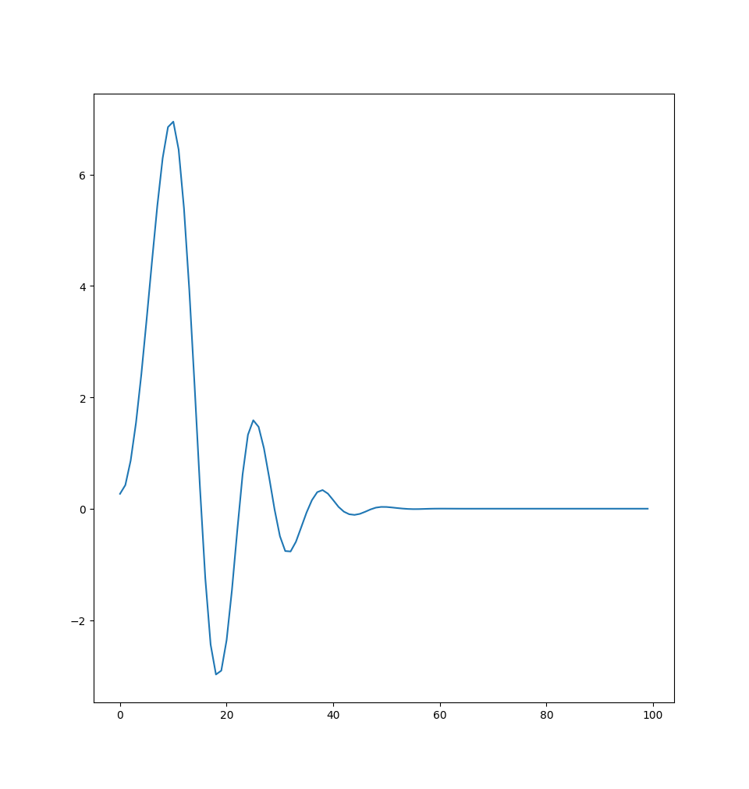

**Parameters**

|Name|Type|Description|
|----|----|-----------|
|frequency|Float|Number of hear beats per 100 points|


## Polynomial

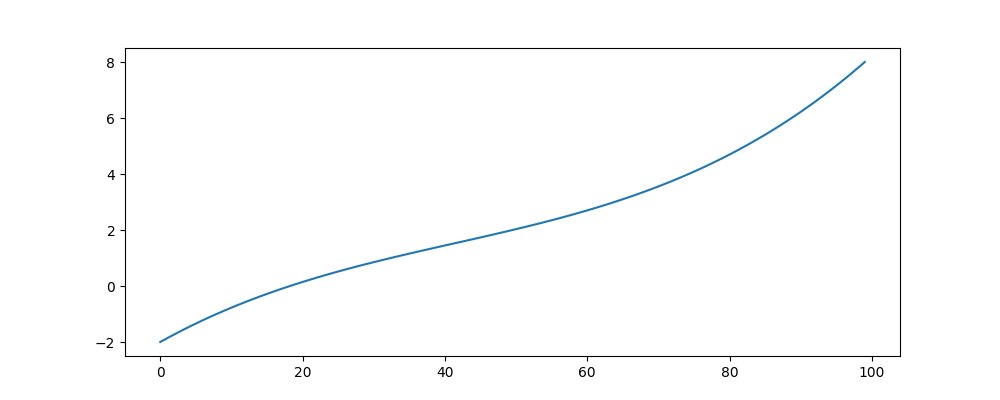

**Parameters**

|Name|Type|Description|
|----|----|-----------|
|polynomial|List[Float]|[Please see numpy documentation](https://numpy.org/doc/stable/reference/generated/numpy.polynomial.polynomial.Polynomial.html#numpy.polynomial.polynomial.Polynomial)|

## Random Mode Jump

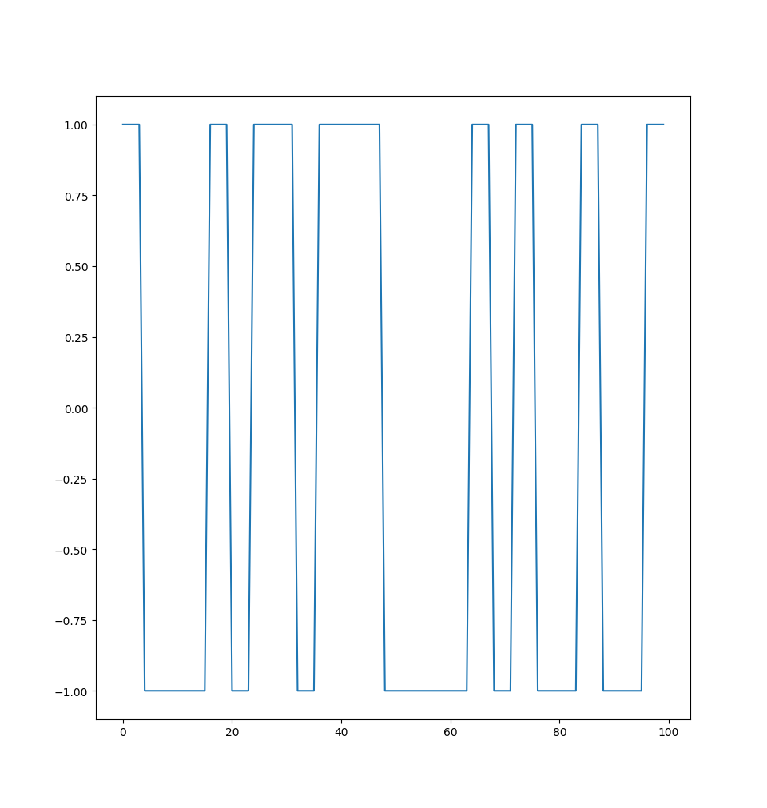

**Parameters**

| Name           | Type  | Description                                               |
|----------------|-------|-----------------------------------------------------------|
| frequency      | Float | Number of jumps in Time Series                            |
| channel_diff   | Float | Value difference of absolute mode values between channels |
| channel_offset | Float | Value offset from 0 in both directions                    |
| random_seed    | Int   | Random seed to have the similar channels                  |

## Sawtooth

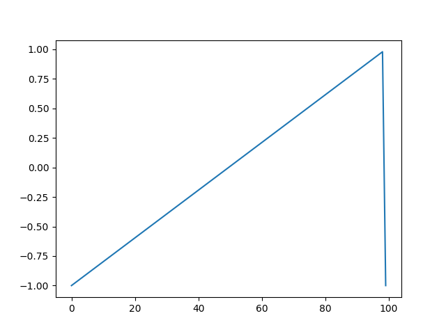

**Parameters**

| Name      | Type  | Description                                                                                                                                             |
|:----------|:------|:--------------------------------------------------------------------------------------------------------------------------------------------------------|
| frequency | Float | Number of waves per 100 points                                                                                                                          |
| amplitude | Float | +/- deviation from 0                                                                                                                                    |
| freq-mod  | Float | Factor (of base frequency) of the frequency modulation that changes the amplitude of the wave over time. The carrier wave always has an amplitude of 1. |
| width     | Float | >0.5 rising, <0.5 falling; sets proportional width of rising slope.                                                                                     |

## Dirichlet

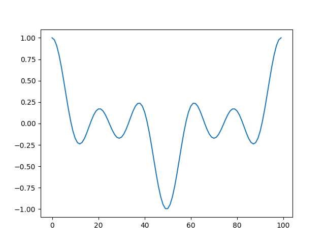

**Parameters**

| Name        | Type  | Description                                                                                                                                                                                        |
|:------------|:------|:---------------------------------------------------------------------------------------------------------------------------------------------------------------------------------------------------|
| frequency   | Float | Number of waves per 100 points                                                                                                                                                                     |
| amplitude   | Float | +/- deviation from 0                                                                                                                                                                               |
| periodicity | Float | Sets the periodicity of the dirichlet wave (higher numbers have a higher complexity), but the high-level period length is not changed. However, even periodicity numbers double the period length. |

## Maximum Length Sequence (MLS)

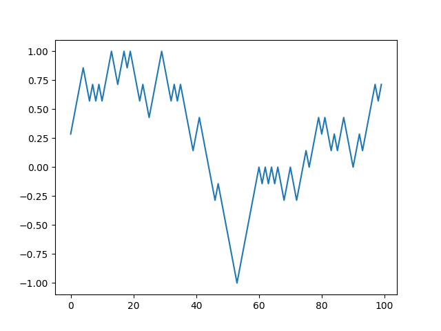

**Parameters**

| Name        | Type  | Description                                                                                                              |
|:------------|:------|:-------------------------------------------------------------------------------------------------------------------------|
| amplitude   | Float | +/- deviation from 0                                                                                                     |
| complexity  | Float | The number of bits used to generate the sequence. This controls the length of the repeating sequence and its complexity. |
| smoothing   | Float | Smoothing factor for convolutional smoothing of the generated bit sequence (highly recommended). Default is 0.01.        |

## Custom Input
Enables the user to add synthetic labeled anomalies to a time series file.

The current requirements on the data are:
* Column headers: timestamp, value_col_name0, value_col_name1, ...
* Selection of columns to use
* No anomalies (and no labels) present
* The input file path(s) may be specified relative to the project root folder


**Parameters**

| Name                       | Type  |Description                                                                                                   |
|:---------------------------|:------|:-------------------------------------------------------------------------------------------------------------|
| input-timeseries-path-test | String| location of an input time-series csv file relative to the project root folder used to make test set          |
| input-timeseries-path-train| String| location of an input time-series csv file relative to the project root folder used to make train set         |
| usecols                    | List  | columns from input file to use                                                                               |

## Formula

**Parameters**

| Name        | Type        | Description                      |
|-------------|-------------|----------------------------------|
| base        | Int, Object | Base time series to operate on.  |
| operation   | Object      | Operation done on base object.   |
| aggregation | Object      | Aggregation done on base object. |

The `formula` base oscillation is a simple math engine that can perform primitive math operations on multiple already generated channels.

### Syntax

**Formula Object**

The `FormulaObj` is the base to every `formula`. It consists of three fields: `base`, `operation`, and `aggregation`.
The `base` defines the first operand. It can either be a channel id (`int`) or another `FormulaObj`. The `base` can be the only field in a `FormulaObj` and then simply copies the channel with the right id (`base:int`).
It can also have a field `operation` or `aggregation`. However, it cannot have both at the same time.

```yaml
# FormulaObj
base: Union[int, FormulaObj]
operation: Optional[Operation]
aggregation: Optional[Aggregation]
```

**Operation**

The `Operation` is the vectorized math operation that is performed on the `base`. It consists of two required fields: `kind`, and `operand`.
The `kind` field is an enum that defines which math operator to perform. The `operand` field is the operand that is calculated to the before-defined `base`. The `operand` can be a scalar value or another `FormulaObj`.

```yaml
# Operation
kind: Enum[+, -, *, /, **]
operand: Union[float, FormulaObj]
```

**Aggregation**

The alternative to the `Operation` is the `Aggregation` field. This field defines an aggregation operation on the `base`. Its result is either a scalar or an array. It consists of two fields: `kind`, and `axis`.
The `kind` field defines the kind of aggregation performed on a numpy array. The optional `axis` field defines the axis of the array the aggregation is performed on. If no `axis` is defined, the aggregation will return a scalar. 

```yaml
# Aggregation
kind: Enum[sum, min, max, median, std, var]
axis: Optional[int]
```

**Example**

The following formula:

```python
import numpy as np
a = np.arange(10)
b = np.ones(10)
channels = [a, b]

# formula
(channels[0] + channels[0]) * channels[1].sum()
```

can be defined as the following `FormulaObj`:

```yaml
formula:
  base:
    base: 0           # (channels[0]
    operation:
      kind: "+"       # +
      operand:
        base: 0       # channels[0])
  operation:
    kind: "*"         # *
    operand:
      base: 1         # channels[1]
      aggregation:
        kind: "sum"   # .sum()
```
