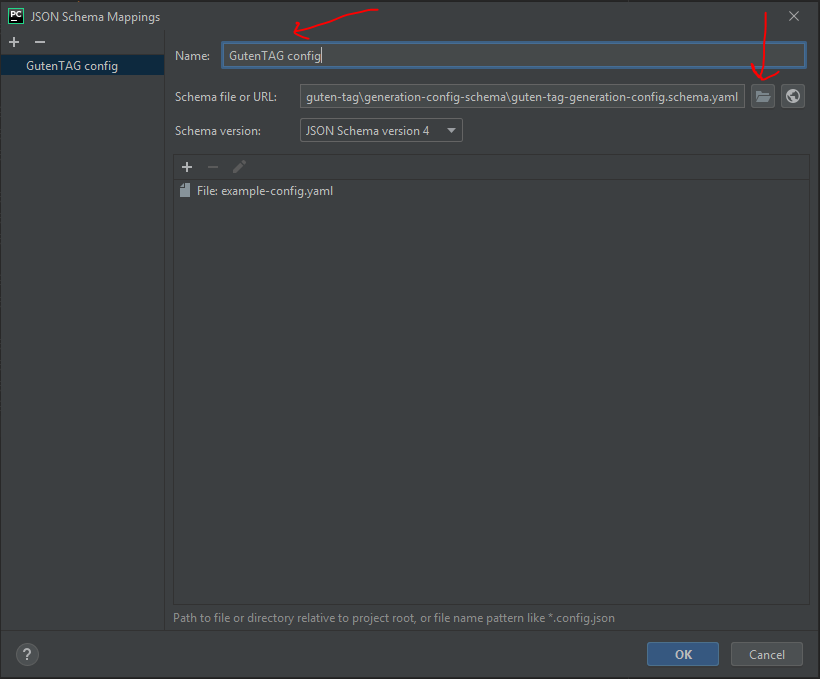

# GutenTAG generation configuration schema

This folder contains the YAML/JSON schema definitions for GutenTAG generation configuration files (such as [`example-config.yaml`](../example-config.yaml)).

The schema can be used to enhance IDEs and editors with syntax highlighting, code completion, and linting features for the GutenTAG configuration files.

The file `guten-tag-generation-config.schema.yaml` is the base schema that references the following sub-schemas:

- `oscillation.guten-tag-generation-config.schema.yaml` for the definition of base oscillations and trends.
- `anomaly.guten-tag-generation-config.schema.yaml` for the definition of anomalies.
- `anomaly-kind.guten-tag-generation-config.schema.yaml` for the definition of anomaly kinds (only used within `anomaly.guten-tag-generation-config.schema.yaml`).

## IDE/Editor configuration

### Visual Studio Code

1. Install and enable the [Red Hat VSCode YAML plugin](https://github.com/redhat-developer/vscode-yaml)
2. Add a mapping for files that should be checked against the GutenTAG schema `guten-tag-generation-config.schema.yaml` to your settings. E.g. for the `example-config.yaml`-file included in this repository:

   ```json
   "yaml.schemas": {
      "./generation-config-schema/guten-tag-generation-config.schema.yaml": [
         "example-config.yaml"
      ]
   }
   ```

### JetBrains (PyCharm)

1. Open the desired file (e.g. the [`example-config.yaml`](../example-config.yaml))
2. In the lower right cornern, click on _No JSON schema_
   
3. In the upcoming dropdown list, select _New schema mapping ..._
4. Select the `guten-tag-generation-config.schema.yaml` from this directory and give this schema a representative name. Hit _OK_.
   
